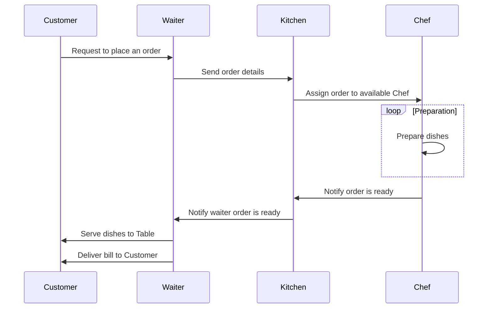

Your task for today is to implement an application to run our new restaurant. Your application should provide the following functionality:
1. Take an order from table with customers
   - Table can have 1 customer or more.
   - Customer can choose one or more dishes from the menu.
   - Each dish can have different price and preparation-time.
   - Table order includes orders from all customers.
3. Send the order to the kitchen by a waiter
4. In the kitchen a chef is working on the order
   - The chef can work only on one order at a time.
6. Once the order is ready, the order should be delivered to the table
   - Order preparation time calculated by the preparation-time of dish with the longest preparation-time included in the order.
   -  When the order is ready one of the waiters should be notified and serve the dishes to the table.
8. After the waiter serve the dishes, he’s also giving the bill to the table
9. Add an option to add more chefs to the restaurant (although currently they have a budget only for one).
   
More Chefs can work on DIFFERENT orders in the same time and reduce waiting time to the customers.

Provide a design of your solution and the architecture of the program.

Show which entities participate in your solution and describe the flow of the solution.

